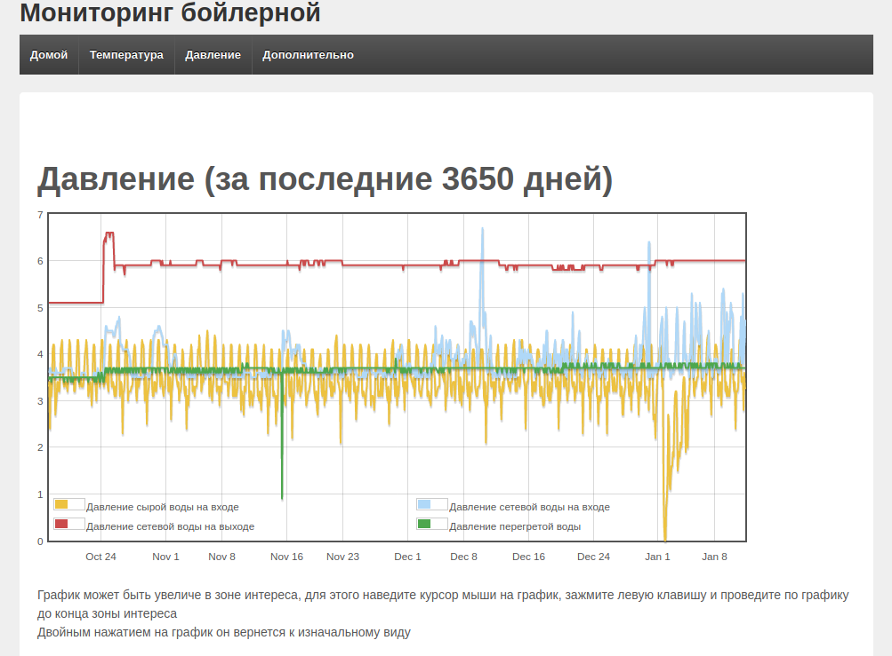
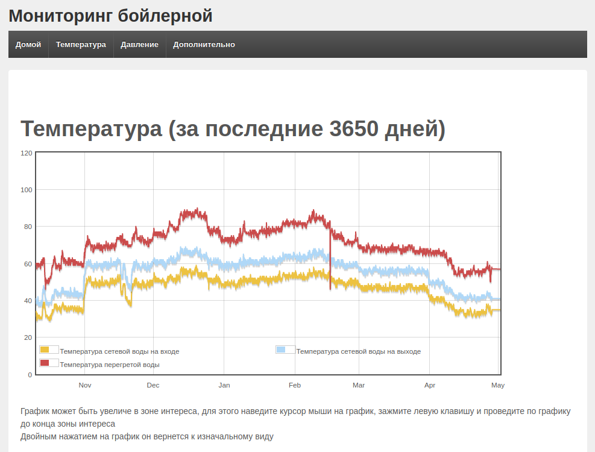

# Web interface of boiler room monitoring

It collects sensor data from the boiler room. The data includes pressure and temperatures of water.

# Email auth

Data is collected with Pop protocol. Set host, user and password in `get_data.cgi` and `get_raw_mail.cgi` files.

# Examples

## Main Page

## Pressure

## Temperature

